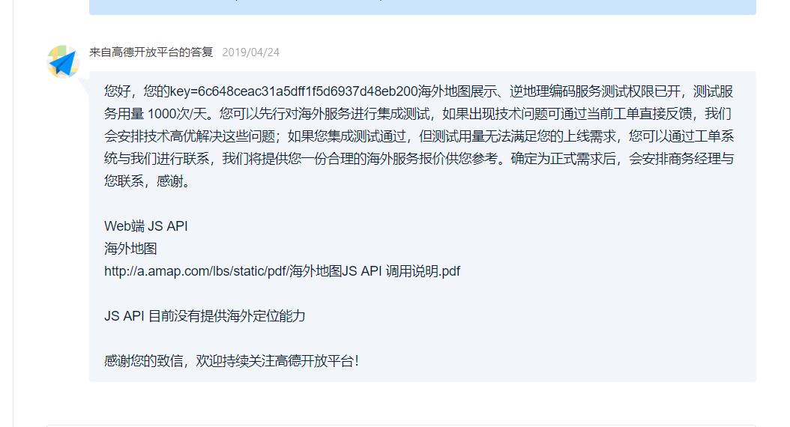
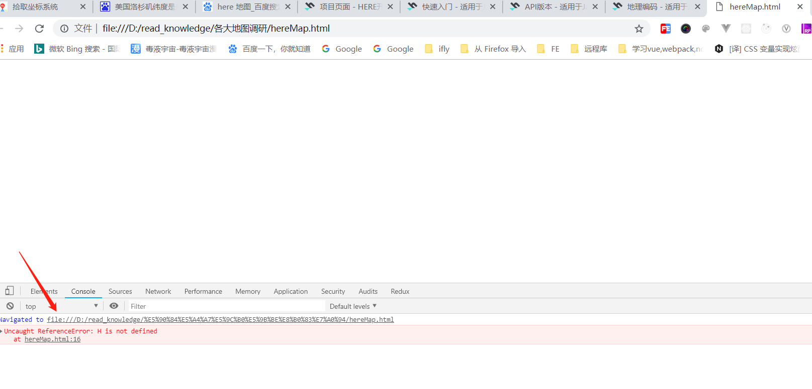
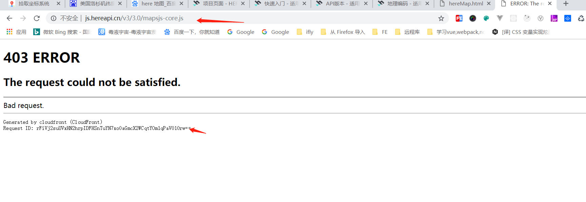

# 1 bing 地图调研
## 前提准备
1. 需要一个微软账号
    官网地址：https://www.bingmapsportal.com/?lc=1033
2. 申请一个密钥key：
   地址：https://www.bingmapsportal.com/Application

3. 本人测试key: ApwZQEXO28_6oTFMMWci8U3ix16pHfwR6Dw98ckS1MYdOtrXCnQEf2iSHYjuTSxs

## 地图api以及sdk调研
1. JS api  （pc,移动端都能打开，但是移动端没有做适配，体验起来不友好）
文档地址：https://cn.bing.com/maps/sdkrelease/mapcontrol/isdk/setmapviewoptions#HTML
Bing Maps 地图控件 SDK 6.2： https://docs.microsoft.com/zh-cn/previous-versions/bb429619%28v%3dmsdn.10%29

2. url访问 （**注意：**目前必应地图只支持pc端打开，手机端无法打开）
url API:https://docs.microsoft.com/en-us/bingmaps/articles/create-a-custom-map-url

## example
1. url访问
```
<!-- 测试地址： -->
// 目前的额问题时url的方式在手机端无法打开页面，只能在pc端看
国内定位测试：
1. https://bing.com/maps/default.aspx?cp=32.040755~118.786015&lvl=15&style=h&rtp=~pos.32.040755_118.786015_我的位置     （中国南京） 带图标(手机端打不开)
2. https://bing.com/maps/default.aspx?cp=32.040755~118.786015&lvl=15&style=h  （中国南京）
国外定位测试：
1. https://bing.com/maps/default.aspx?cp=35.709872~139.752964&lvl=15&style=h&rtp=~pos.35.709872_139.752964_我的位置  （日本东京）带图标(手机端打不开)
2. https://bing.com/maps/default.aspx?cp=35.709872~139.752964&lvl=15&style=h （日本东京）
```

| 参数 | 定义 | 例 | 细节 |  
:-:|:- |:-:|:-
| CP | 中心点 | CP = 47.677797〜-122.122013 | 定义地图中心的位置。对cp参数使用以下格式：Latitude~Longitude两个值必须以十进制度表示。纬度和经度通常以十进制度表示为两个数字，例如-47.677797（纬度）和-122.122013（经度）。|
|LVL | 缩放级别 |	LVL = 5	|定义地图视图的缩放级别。有效值为1-20。当指定搜索参数（例如ss或where1）时，将忽略此参数。下面提供了搜索参数表。|
|样式|地图视图|风格= R|定义地图视图。此参数的有效值包括:a：显示地图的鸟瞰图。r：显示地图的道路视图。h：显示带有标签的地图的鸟瞰图。o：使用此值显示地图的鸟瞰（倾斜）视图。b：显示鸟瞰图（倾斜），带有地图的标签视图。|
|现场|场景ID参考|现场= 3715328|指定要显示的鸟瞰图（倾斜）图像图块的ID。您可以将此参数与lvl值1或2以及dir值一起使用，以查看地图图像的不同格式。|
|DIR|方向|DIR = 180	|指定摄像机以度为单位指向的方向。North的有效值为0，East为90，South为180，West为270。|
|TRFC|交通|TRFC = 1|指定是否在地图上包含交通信息。省略trfc参数会产生与trfc = 0相同的结果|

2. JS api
实列看example中bing目录下的bingMapIn.html和bingMapOut.html分别定位了国内和海外

[海外定位测试地址](http://118.24.51.92/maptest/bingMapOut.html
)

[国内定位测试地址](http://118.24.51.92/maptest/bingMapIn.html
)

# 2 高德地图
## 前提准备
1. 需要一个账号
    官网地址：https://lbs.amap.com
2. 申请一个密钥key：
   地址：https://lbs.amap.com/dev/key/app
3. 测试key: 6c648ceac31a5dff1f5d6937d48eb200
## 地图 web URL api以及sdk调研  
1. url API (适用移动端和PC端,但是不支持国外定位)
url API ： https://lbs.amap.com/api/uri-api/summary/
暂不支持国外的定位

2. JS api目前也不支持海外定位，需要申请使用海外LBS服务
    申请地址：https://lbs.amap.com/getting-started/oversea-lbs
3. 国外的需要申请（申请使用海外LBS服务），需要2-3天进行审核，目前还不知道是否可用
   
## example
1. url API
   ```
    <!-- 测试地址 -->  
    国内定位测试： 
    uri.amap.com/marker?position=118.784136,32.041806&name=新街口&src=mypage&coordinate=gaode&callnative=0（中国南京）
   

    国外定位测试： 
    uri.amap.com/marker?position=139.752964,35.709872&name=东京&src=mypage&coordinate=gaode&callnative=0（日本东京）
    
   ```
   |参数名称|值(点击可编辑)|参数说明|是否必选|备注|
   |:-|:-:|:-:|:-|:-|
   |position|121.287689,31.234527|位置点经纬度坐标，格式为: position=lon,lat|是|lon表示经度，lat表示纬度|
   |name |park |用户自定义显示名称 | 否| |
   |src |mypage | 使用方来源信息| 否| 为保证服务质量建议填写|
   | coordinate|gaode | 坐标系参数coordinate=gaode,表示高德坐标（gcj02坐标），coordinate=wgs84,表示wgs84坐标（GPS原始坐标）|否 |默认为高德坐标系（gcj02坐标系） |
   | callnative| 0|是否尝试调起高德地图APP并在APP中查看，0表示不调起，1表示调起, 默认值为0 | 否| 该参数仅在移动端有效|

2. JS api
   实例：example中gaode目录下的gaodeMapIn.html和gaodeMapOut.html分别定位了国内和海外 
   [海外定位测试地址](http://118.24.51.92/maptest/gaodeMapOut.html
    )

    [国内定位测试地址](http://118.24.51.92/maptest/gaodeMapIn.html
    )


# 3 百度地图
## 前提准备
1. 需要一个账号
    官网地址：http://lbsyun.baidu.com/
2. 申请一个密钥key：
   地址：http://lbsyun.baidu.com/apiconsole/key
3. 测试浏览器AK: 42WFQp7IhguX3huulLaGanobA36B2KeC
## 地图 web URL api以及sdk调研  
1. web API (适用移动端和PC端,但是不支持国外定位)
全球逆地理编码： http://lbsyun.baidu.com/index.php?title=webapi/guide/webservice-geocoding-abroad

2. JS的API目前也不支持海外定位
    申请地址：http://lbsyun.baidu.com/index.php?title=jspopular
    测试实例:

    [海外定位测试地址]( http://118.24.51.92/maptest/baiduMapOut.html
    )

    [国内定位测试地址](http://118.24.51.92/maptest/baiduMapIn.html
    )

3. URI API（不需要申请ak,但是不支持国外定位）
   文档：http://lbsyun.baidu.com/index.php?title=uri
   ```
   国内定位测试：（这里注意经纬度的顺序）
   http://api.map.baidu.com/marker?location=32.041806,118.784136&title=我的位置&content=新街口&output=html&src=webapp.baidu.openAPIdemo 

   国外定位测试： 
   http://api.map.baidu.com/marker?location=35.709872,139.752964&title=我的位置&content=东京&output=html&src=webapp.baidu.openAPIdemo
   ```

<!-- 4. 关于百度的境外AK申请值适用于服务端类型
 -->

# 4 google 地图 （目前测试在国内无法使用）
相关文档见： [google-map.md](./google-map.md)
url 测试地址：
```
国内： https://www.google.com/maps/search/?api=1&query=32.041806,118.784136
国外： https://www.google.com/maps/search/?api=1&query=35.709872,139.752964 
```

# 5 here 地图
## 前提准备
1. 需要一个账号
    官网地址：https://www.here.com/
2. 申请一个的JAVASCRIPT / REST：
   APP ID和APP CODE
   地址：https://developer.here.com/projects
## 地图api测试
1. Maps API for JavaScript
   测试文件： hereMap.html
   测试结果： 无法使用官方给的实例在加载时API代码库被禁止访问
   所以here地图测试仅此结束
   
   